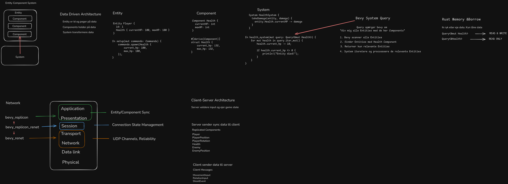
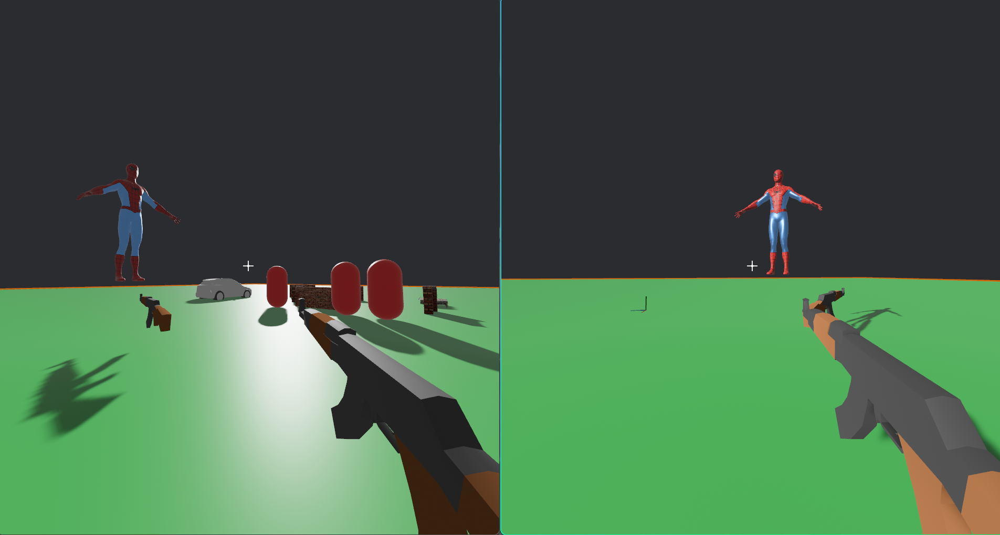

# Multiplayer 3D Shooter

A server-authoritative multiplayer 3D shooter built with Rust and the Bevy game engine. Players can connect to a dedicated server, move around a 3D world, and engage in combat.

This project was created for a presentation explaining Bevy, ECS architecture, Rust memory management, and multiplayer networking using Replicon and Renet.



## Gameplay



## What is This?

This is a networked multiplayer game where:
- **Server** owns and validates all game state (player positions, health, inventory)
- **Clients** send input commands and render the replicated game state
- **Server-authoritative model** prevents cheating and ensures consistent gameplay

The game features:
- Third-person 3D player movement
- Shooting mechanics with visual tracers
- Real-time state replication between server and clients
- Physics-based interactions

## Technology Stack

### Core Engine
- **[Bevy 0.17.2](https://bevyengine.org/)** - Data-driven game engine built in Rust using ECS (Entity Component System) architecture

### Networking
- **[bevy_replicon 0.36.0](https://docs.rs/bevy_replicon/)** - High-level replication framework for Bevy that automatically synchronizes entities and components between server and clients
- **[bevy_replicon_renet 0.12](https://docs.rs/bevy_replicon_renet/)** - Integration layer connecting bevy_replicon with the renet transport
- **[renet 1.2](https://docs.rs/renet/)** - UDP-based networking library providing reliable and unreliable channels

### Physics
- **[bevy_rapier3d](https://github.com/dimforge/bevy_rapier)** - 3D physics engine integration for Bevy, handling collisions, rigid bodies, and physical interactions

### Assets
All 3D models are created in **Blender** and exported as `.glb` files:
- `assets/models/player.glb` - Player character model
- `assets/models/gun.glb` - Weapon model
- `assets/models/environment.glb` - Environment decoration

## Getting Started

### Cloning the Repository

This project uses **Git LFS** (Large File Storage) for 3D model assets (`.blend` files). You must have Git LFS installed before cloning.

**Install Git LFS:**
- **Linux**: `sudo apt-get install git-lfs` or `sudo pacman -S git-lfs`
- **macOS**: `brew install git-lfs`
- **Windows**: Download installer from [git-lfs.com](https://git-lfs.com/)

After installing Git LFS, initialize it:
```bash
git lfs install
```

**Clone and setup the repository:**
```bash
git clone https://github.com/patrickhaahr/bevy-multiplayer-3d.git
cd bevy-multiplayer-3d
git lfs pull  # Pull LFS-tracked assets (Blender files)
```

If you already cloned the repository, make sure you have the latest changes and LFS assets:
```bash
git pull
git lfs pull
```

## How to Play

### Prerequisites
- [Rust](https://www.rust-lang.org/tools/install) (latest stable version)
- Bevy engine OS dependencies - See the [official Bevy setup guide](https://bevy.org/learn/quick-start/getting-started/setup/#installing-os-dependencies) for your platform

### Starting a Server

Open a terminal in the project directory and run:
```bash
cargo run --features dev server
```

The server will start listening on `0.0.0.0:5000` (all network interfaces).

### Starting a Client

**Connect to localhost (default):**

Open another terminal in the project directory and run:
```bash
cargo run --features dev client
```

**Connect to a specific IP address (hidden input):**

For privacy when streaming or presenting, use the `--ask` flag to enter the IP address securely without displaying it on screen:
```bash
cargo run --features dev client --ask
```

You'll be prompted to enter the server IP address. Your input will be hidden for privacy

**Note:** The `--features dev` flag enables dynamic linking for faster compilation during development. For release builds, omit this flag.

### Controls
- **WASD** - Move player
- **Mouse** - Look around
- **Left Click** - Shoot
- **ESC** - Release mouse cursor

## Development

### Fast Development Builds

For faster iteration during development, use the `dev` feature to enable dynamic linking:
```bash
cargo run --features dev server
cargo run --features dev client
```

This significantly speeds up recompilation times by linking Bevy dynamically instead of statically.

### Building for Release
```bash
cargo build --release
```

Release binaries are statically linked and self-contained. They will be in `target/release/bevy-multiplayer-3d`.

Prebuilt binaries are also available in the [GitHub Releases](https://github.com/patrickhaahr/bevy-multiplayer-3d/releases).

### Running Server and Client Separately
```bash
# Terminal 1 - Server
bevy-multiplayer-3d server

# Terminal 2 - Client (localhost)
bevy-multiplayer-3d client

# Terminal 2 - Client (custom IP, hidden input)
bevy-multiplayer-3d client --ask
```

### Network Configuration
- **Port**: 5000 (UDP)
- **Protocol ID**: `MULTIPLAYER_SHOOTER`
- Default server IP: `127.0.0.1` (localhost)

## Architecture

```
Client Input → Server Validation → State Update → Replicate to All Clients
```

The server runs at a fixed tick rate, processes player inputs, updates physics, and replicates the authoritative game state back to all connected clients. Clients render this state and send their input commands to the server.

For more details, see `AGENTS.md`.

## License

This project is for educational purposes.
